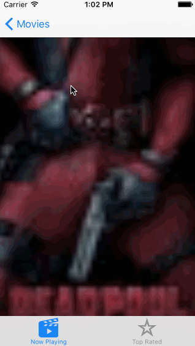

# Week 1 Project - Flicks

Flicks is an application for viewing recent and top rated movies. 

Submitted by: Andrew Duck

Time spent: 6.5 hours spent in total

## User Stories

The following **required** functionality is complete:

* [x] User can view a list of movies currently playing in theaters from The Movie Database. Poster images must be loaded asynchronously.
* [x] User can view movie details by tapping on a cell.
* [x] User sees loading state while waiting for movies API.
* [x] User sees an error message when there's a networking error.
* [x] ser can pull to refresh the movie list.

The following **optional** features are implemented:
* [x] Add a tab bar for Now Playing or Top Rated movies.
* [ ] Implement a UISegmentedControl to switch between a list view and a grid view.
* [x] Add a search bar.
* [x] All images fade in as they are loading.
* [x] For the large poster, load the low-res image first and switch to high-res when complete.
* [x] Customize the highlight and selection effect of the cell.
* [ ] Customize the navigation bar.

The following **extra** features are implemented: 
* [x] Implemented refresh button on network failure to retry connection. 

## Video Walkthrough 

GIF created with [LiceCap](http://www.cockos.com/licecap/).

## Notes

 

## License

Copyright [2016] [Andrew Duck]

Licensed under the Apache License, Version 2.0 (the "License");
you may not use this file except in compliance with the License.
You may obtain a copy of the License at

http://www.apache.org/licenses/LICENSE-2.0

Unless required by applicable law or agreed to in writing, software
distributed under the License is distributed on an "AS IS" BASIS,
WITHOUT WARRANTIES OR CONDITIONS OF ANY KIND, either express or implied.
See the License for the specific language governing permissions and
limitations under the License.
